# User Documentation

[PDF version](./gw3-opencart-plugin.pdf)

## Installation
- Download latest module version from [distributions](../dist/)
- Install module using standard OpenCart module installer (`Extensions > Installer > Upload File`) 
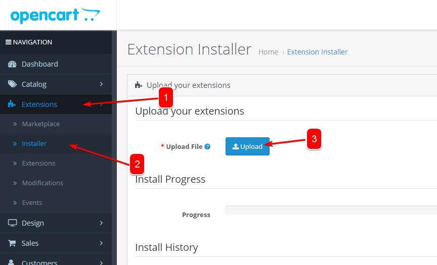
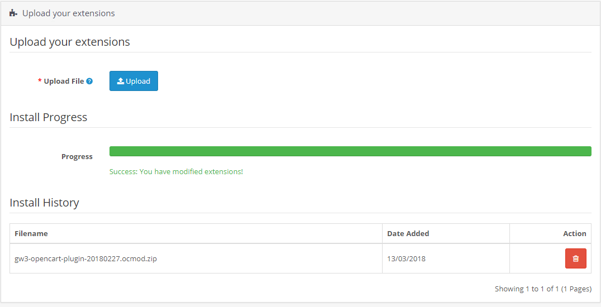

## Initial configuration
- Enable and configure module in OpenCart admin (`Extensions > Extensions > Paymens > Transact Pro`) 
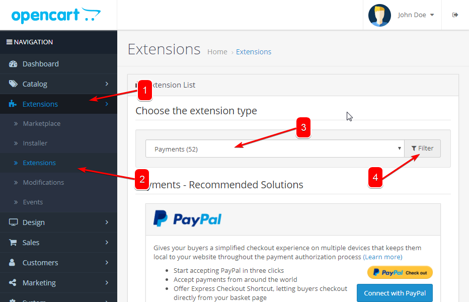
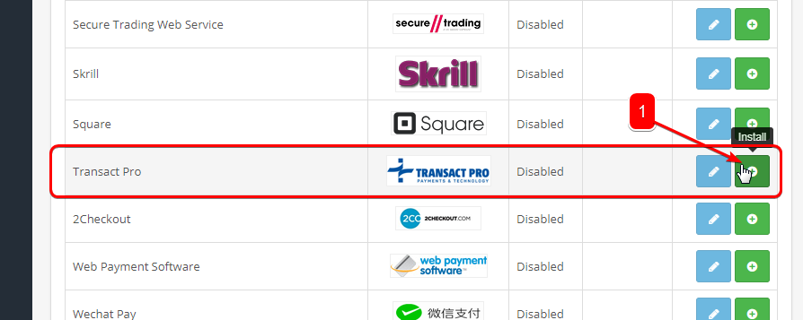

### Setting tab

#### Settings
- `Extension status`: Enabled - Enables or disables Transact Pro module
- `Payment method name`: Credit / Debit Card - This will be shown in payment options list on Checkout page
- `Callback URL`: - You can not change that, this information is needed for Transact Pro support team to properly configure your account
- `Redirecr URL`: - You can not change that, this information is needed for Transact Pro support team to properly configure your account
- `Gateway URL`: - Leave empty for sandbox mode (`https://api.sandbox.transactpro.io/v3.0`) or enter the information received from Transact Pro support team (usually it's `https://api.transactpro.lv/v3.0`)
- `Account ID`: - Specify your numeric Account ID received from the Transact Pro support team, the specific Account ID is related the whay payments being processed
- `Secret Key`: - Specify your Secret Key received from the Transact Pro support team 
- `Payment Method`: Choose payment method you want to use (`SMS` is most common used)
  Supported methods are:
    - SMS: Customer will charded imidiatelly, transaction can be reverted manually
    - DMS: Funds will be reserved, merchant can charge them or cancel manually
    - Credit: Funds will be transferred to merchant's credit card
    - P2P: Funds will be transferred to merchant's credit card using P2P method
- `Payment Infomation Capture`: Choose `Merchant Side` (credit card details will be entered on `Checkout` page) or `Payment gateway side` (client will be redirected to payment gateway page to enter credit card details). 
  **Note:** `Payment Infomation Capture` depends from `Account ID`, you need to set corresponded `Account ID` value for correct work.
  For example, you have following Account ID values:
    - 100: CARD DETAILS COLLECTED ON GW SIDE_3D_V     - That means Security 3D transactions, customer will be redirected to payment gateway to enter credit card information, you need to set `Payment Infomation Capture` as `Payment gateway side` 
    - 101: CARD DETAILS COLLECTED ON GW SIDE_NON 3D_V - That means non-3D transactions, customer will be redirected to payment gateway to enter credit card information, you need to set `Payment Infomation Capture` as `Payment gateway side` 
    - 200: CARD DETAILS COLLECTED ON API_3D_V         - That means Security 3D transactions, customer will enter credit card information directly on Checkout page, you need to set `Payment Infomation Capture` as `Payment gateway side` 
    - 201: CARD DETAILS COLLECTED ON API_NON3D_V      - That means non-3D transactions, customer will enter credit card information directly on Checkout page, you need to set `Payment Infomation Capture` as `Payment gateway side` 
- `Total`, `Geo Zone`: Conditions when that payment method can be used
- `Sort Order`: The position of that payment method in the payments options list on Checkout page

#### Transaction Statuses
On this section you need to set relations between transaction statuses (left) and order statuses (right)
for example:
- `INIT`: `Pending`
- `SENT_TO_BANK`: `Pending`
- `HOLD_OK`: `Processing` or `Complete`
- `DMS_HOLD_FAILED`: `Failed`
- `SMS_FAILED`: `Failed`
- `DMS_CHARGE_FAILED`: `Failed`
- `SUCCESS`: `Processig` or `Complete` 
and so on...
**Note:** the particular OpenCart configuration can have diferrent order statuses.
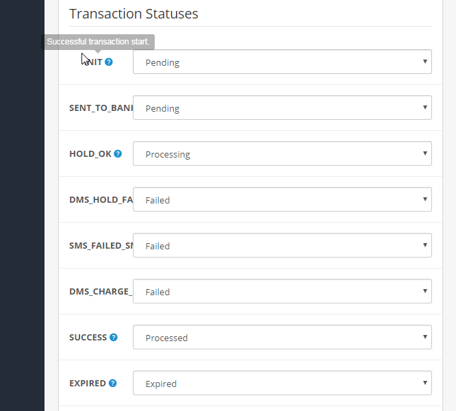

### Transactions tab
See [Transaction handling](#transactions) section

### CRON tab

#### CRON execution methods
- `Method #1 - CRON Task` and `Method #2 - Remote CRON` fields are using to provide the way how cron will run
- `Setup confirmation`: - You need to check this before save module configuration

#### Admin notifications
- `Send e-mail summary:` Enabled - System will send the email to the given email (see `Send task summary to this e-mail`) after each cron task execution
`Send task summary to this e-mail`: Admin email - The email address to receive cron task status emails

### Recurring Payments tab
- `Status of recurring payments`: Enabled - Allow use this payment method for recurring products

#### Customer notifications
- `Recurring Transaction Successful`: Enabled - Notify the customer when recurring transaction successfully executed
- `Recurring Transaction Failed`: Enabled - Notify the customer when recurring transaction failed

### Global settings
**The Transact Pro gateway currently operates with Euro only!**
Please, configure your OpenCart instance to operate Euro by default (`System > Settings > Your Store`):
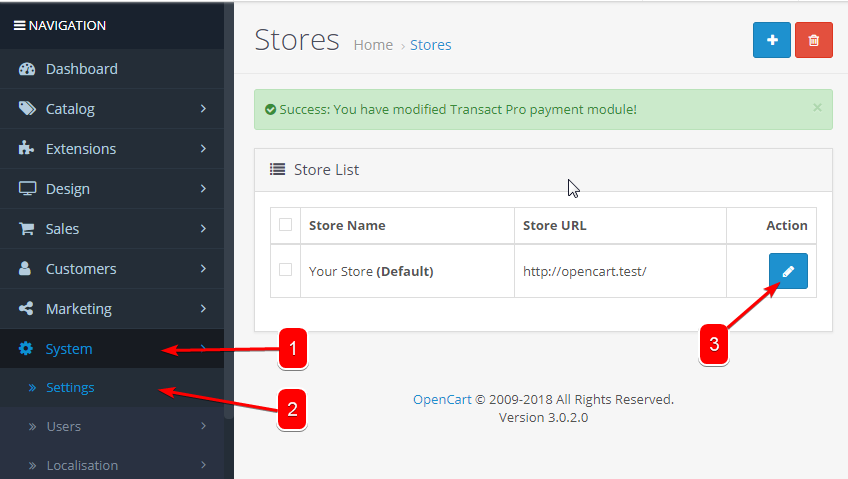
Go to `Local` tab and choose `Currency`: `Euro`
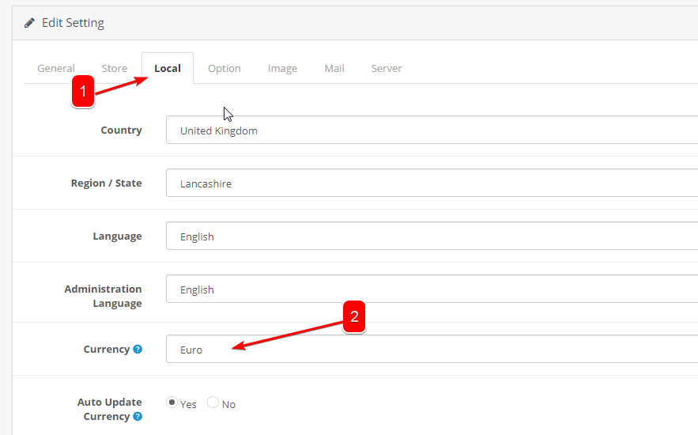
                                               
## Transaction handling

### Customer
#### Executing transaction
Select `Credit / Debit Card` (the name depends from the `Payment method name` settings) 
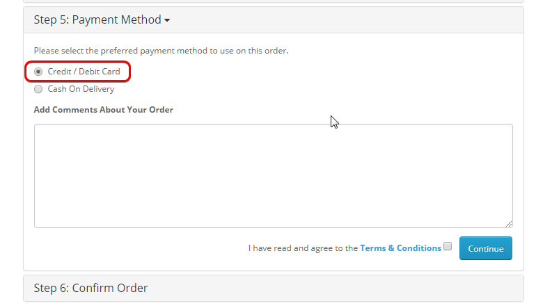

Fill card details (depends from the `Payment Infomation Capture` settings)
- directly on Checkout page:
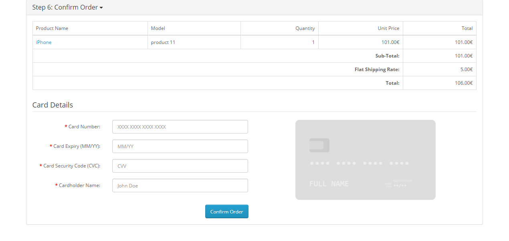

- or Payment Gateway page:
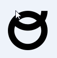

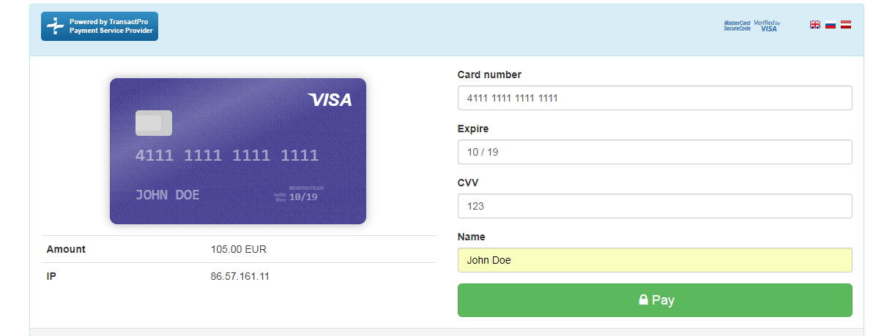

#### Check transaction status

### Merchant

#### Transaction list
Go to Transact Pro payment module settings and activate `Transactions` tab:
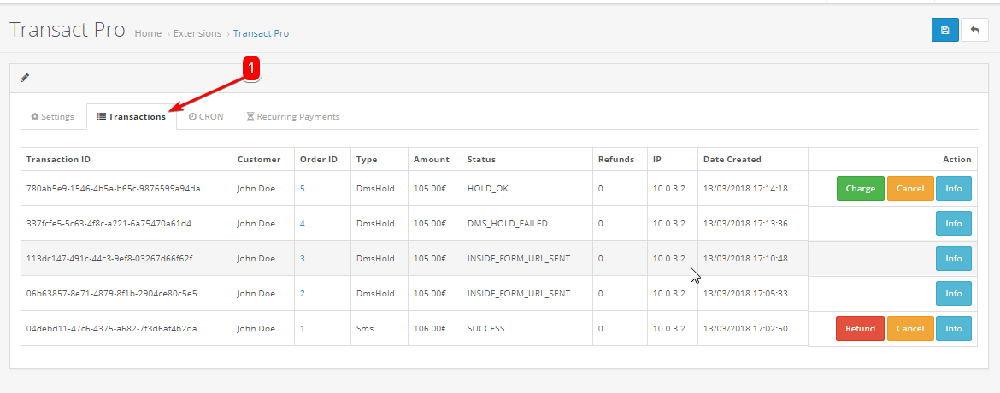
Depends on transaction status and type, ypu can perform different operations

#### Transaction details
Click `Info` button for the corresponded transaction
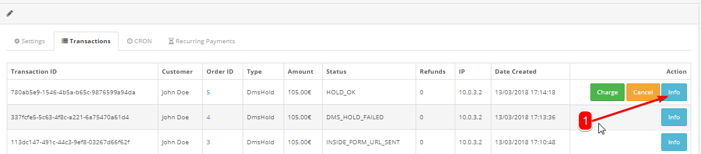
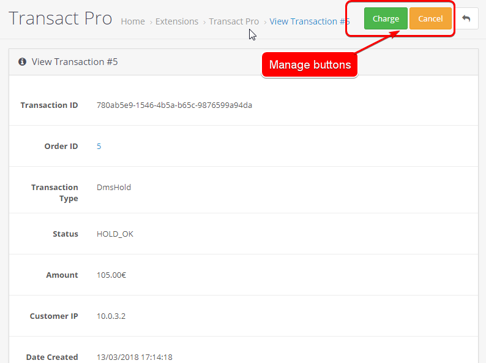

#### Charge transaction
Only `DMS` transaction with the status `DMS_HOLD_OK` can be charged
- Click `Charge` button for the corresponded transaction (on transactions list or transaction details page)
  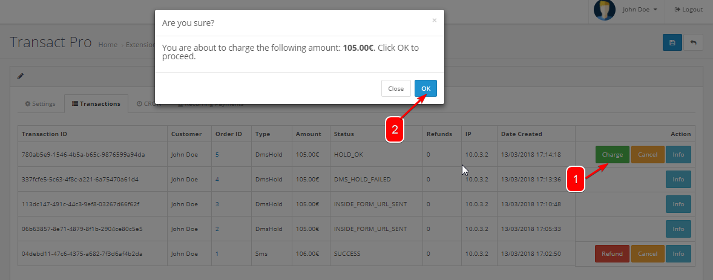
- Then click `OK` button in the popup
  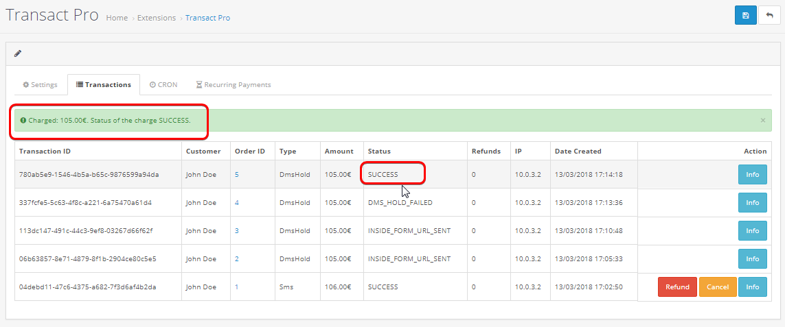

#### Cancel transaction
You can cancel `SMS` transaction with the status `SUCCESS` or `DMS` transaction with the status `DMS_HOLD_OK`
- Click `Cancel` button for the corresponded transaction (on transactions list or transaction details page)
  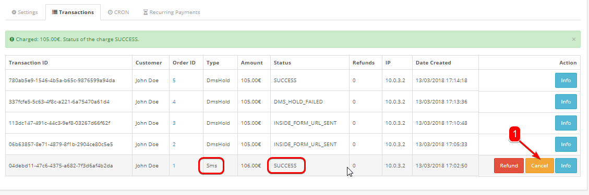
- Then click `OK` button in the popup
  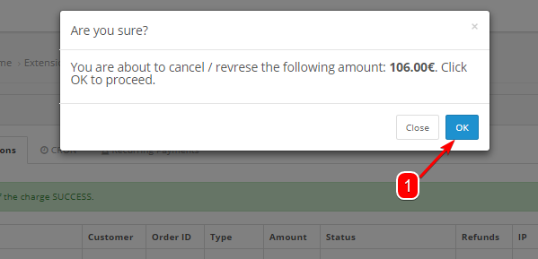
- See result
  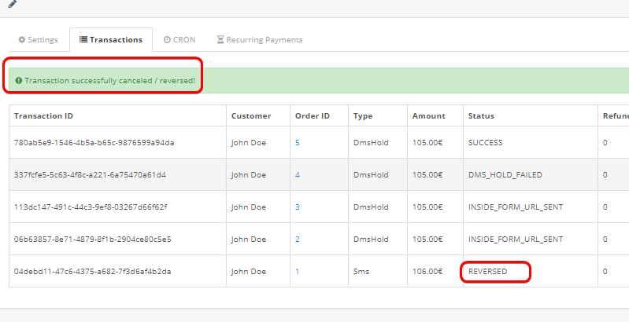

#### Refund transaction
Only `SMS` transaction with the status `SUCCESS` 
- Click `Refund` button for the corresponded transaction (on transactions list or transaction details page)
  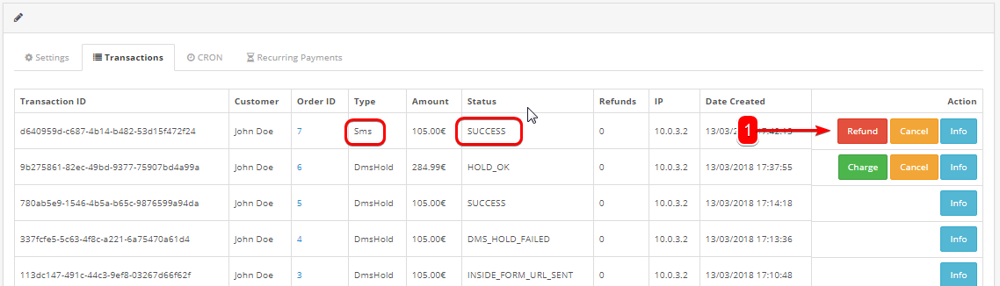
- Provide refund reason, refund amount and then click `OK` button in the popup
  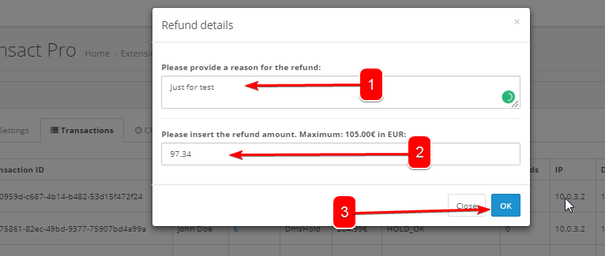
- Refunds list shown on transaction details page
  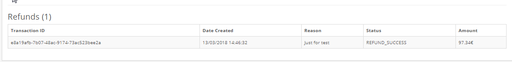

**Note:** Summary refunds amount can't be more than original transaction amount, otherwise payment gateway will reject the refund
  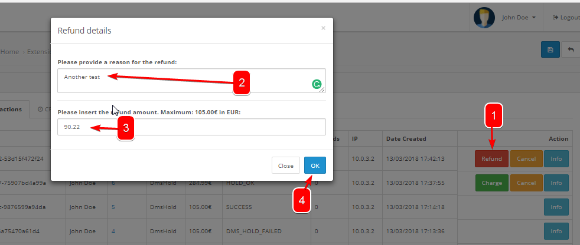
  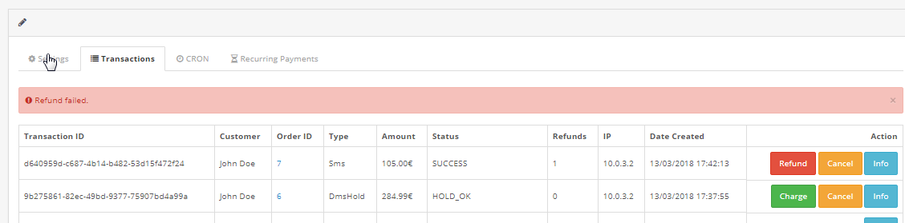
  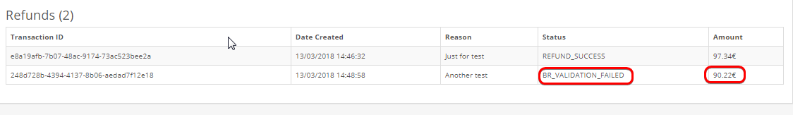

#### Orders
Order statuses are automatically adjusted corresponded to the transaction statuses
You can see corresponded order by clicking on Order ID in transactions list or transaction details page:
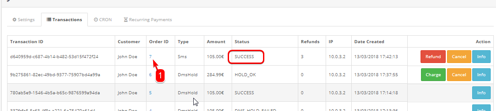
`Order History` keeps all order status changes
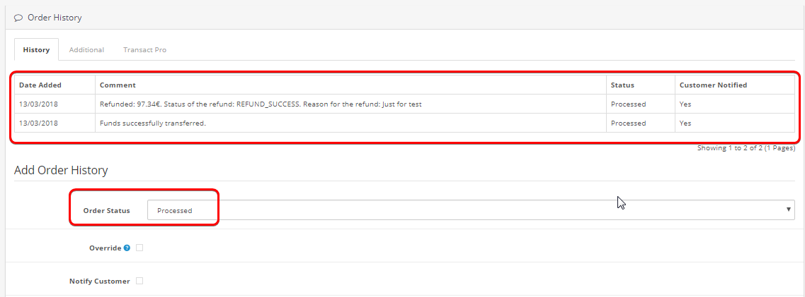
`Transact Pro` tab contains the list of associated transactions
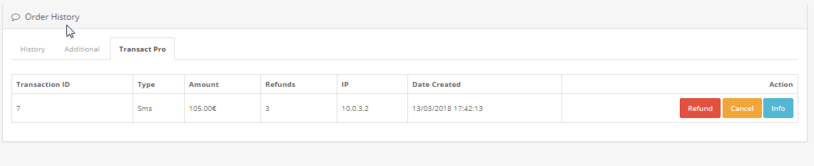
 
## Recurrings
To use Recurrent payments you need make some configurations for OpenCart. Follow [official guide](http://docs.opencart.com/sale/recurring/)

The `Daily Subscription` product was created and placed to the shopping cart:
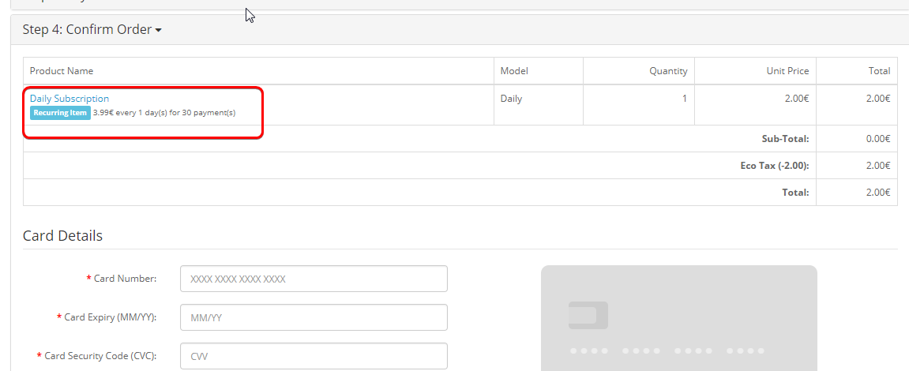

Customer can see recurrrent payments on the corresponded Profile area:
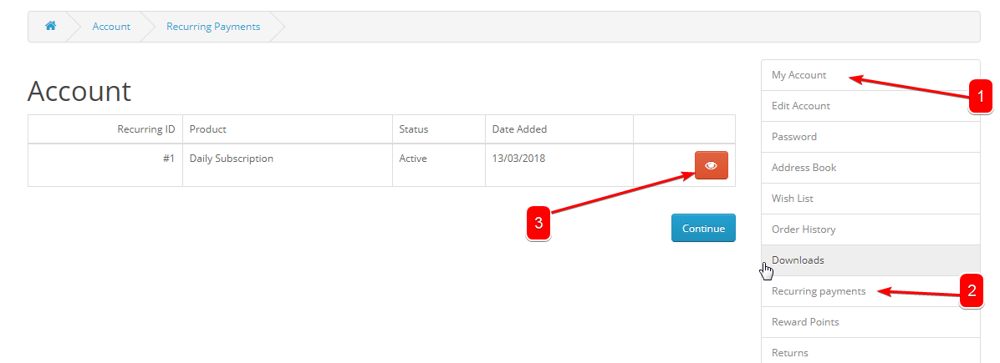

Recurring details:
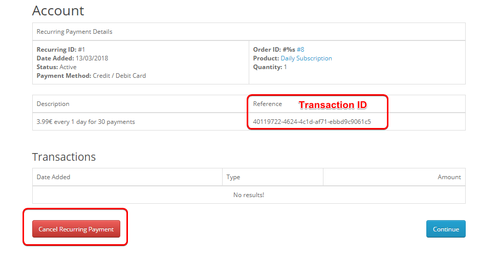

Merchant can see recurring transactions in Transact Pro module configuration on Transactions tab:
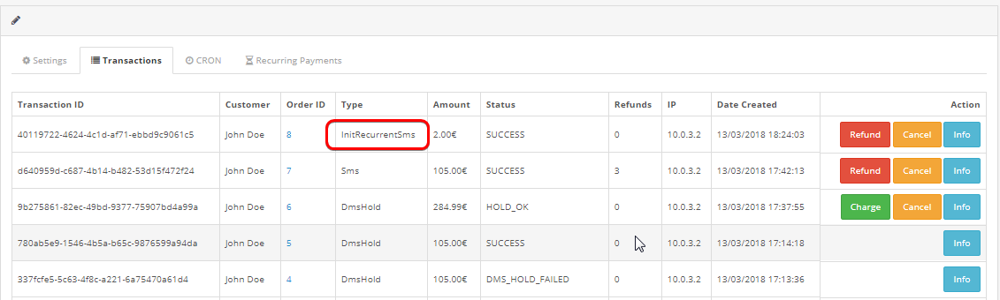

